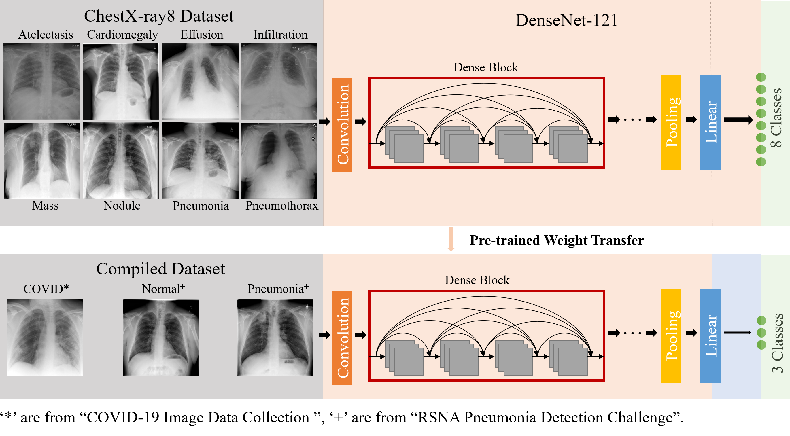

Overview
----
This repository is a PyTorch implementation of the paper "COVID-SCREENNET: AN AI POWERED POPULATION SCREENING OF COVID-19 CASES USING CHEST RADIOGRAPHY IMAGES".

Dataset
-----

Transfer Learning
----

Models
----
The model weights can be download at...

Dependencies
-----

