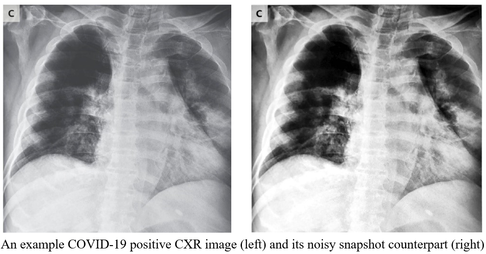
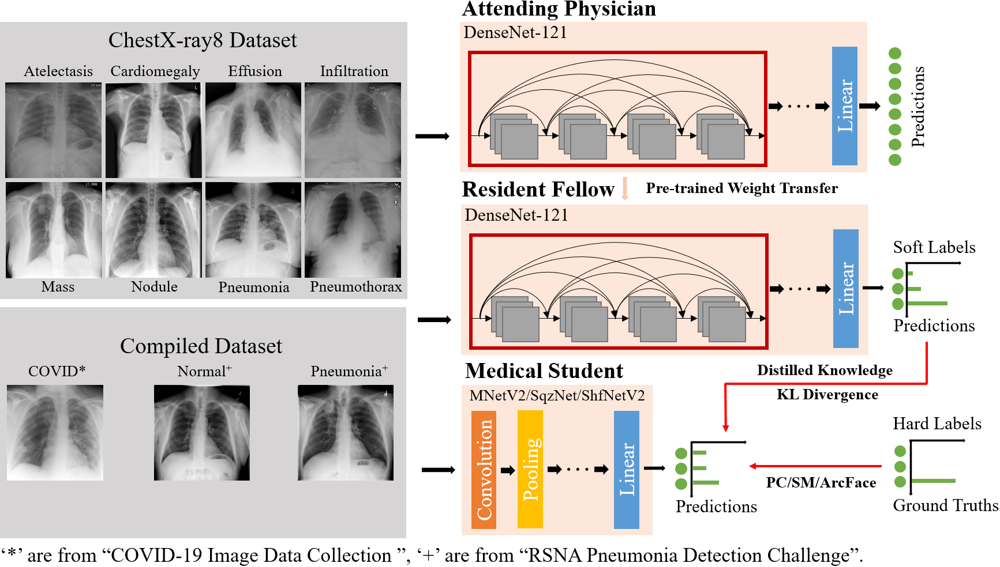
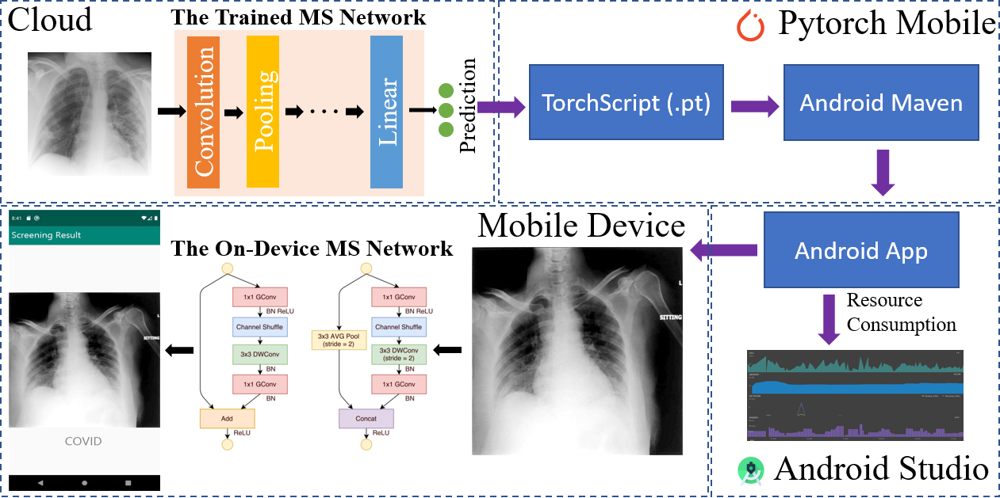
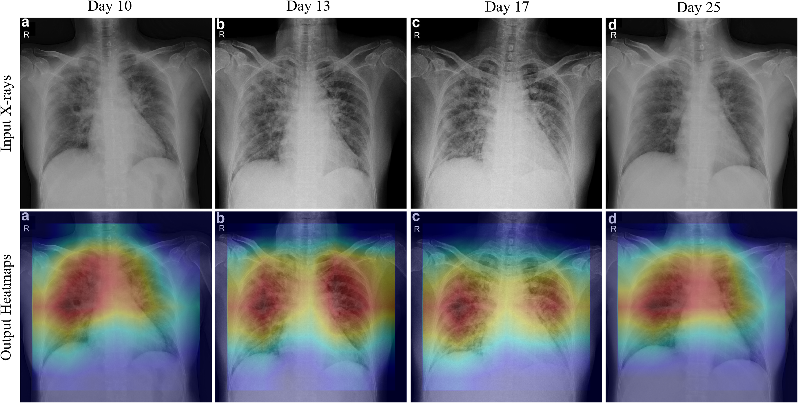
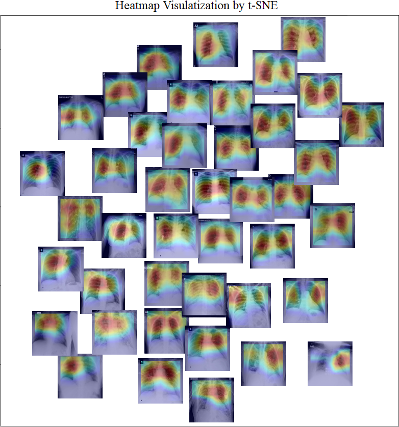

Overview
----
This repository is an implementation of the paper "[COVID-MobileXpert: On-Device COVID-19
Screening using Snapshots of Chest X-Ray](https://arxiv.org/abs/2004.03042)".

CXR Images Dataset
-----
* Pre-training Dataset
  * [ChestX-ray8: Hospital-scale Chest X-ray Database and Benchmarks on Weakly-Supervised Classification and Localization of Common Thorax Diseases.](https://nihcc.app.box.com/v/ChestXray-NIHCC)  
* Fine-Tuning Dataset
  * [COVID-19 Image Data Collection.](https://github.com/ieee8023/covid-chestxray-dataset)  
  * [RSNA Pneumonia Detection Challenge.](https://www.kaggle.com/c/rsna-pneumonia-detection-challenge)  
* Compiled dataset is split into training/validation/testing sets with 125/18/36 images for each class.

Snapshots Dataset
------
We first display the CXR image on PC screen and then use "Microsoft Office Lens" to scan and save the snapshot. Noisy snapshots will be converted to 8-bit gray-scale images.  
Here is one example:
<p></p>


COVID-MobileXpert Architecture with three-player KTD training
----



On-device deployment of the COVID-MobileXpert
------



Some Results
----
Longitudinal XCR images of a patient over the four time points.  




Models
----
The model weights are available [here](https://drive.google.com/drive/folders/1AUtsxjPNVJiTboFFTzzqyeCKBPvMxbII?usp=sharing).  
You can test your own image by:
```
python testing.py --image <X-ray path>
```

Android Deployment
-------
We provide the source code for deployment with Pytorch Mobile. The source code is modified based on this [repository](https://github.com/johnolafenwa/PytorchMobile).


Thumbnail of Generated Heatmaps
-----
<p></p>


Dependencies
-----
* Python 3.7
* Pytorch 1.4

Citation
------
```
Xin Li, Chengyin Li and Dongxiao Zhu
COVID-MobileXpert: On-Device COVID-19Screening using Snapshots of Chest X-Ray  
https://github.com/xinli0928/COVID-Xray
```
```
@misc{li2020covidxpert,
    title={COVID-Xpert: An AI Powered Population Screening of COVID-19 Cases Using Chest Radiography Images},
    author={Xin Li and Dongxiao Zhu},
    year={2020},
    eprint={2004.03042},
    archivePrefix={arXiv},
    primaryClass={eess.IV}
}
```
