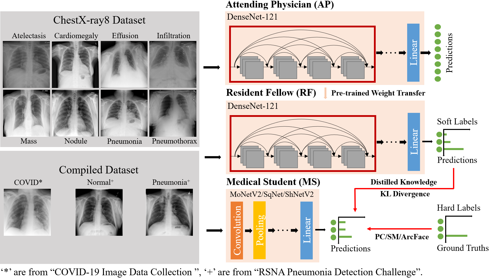
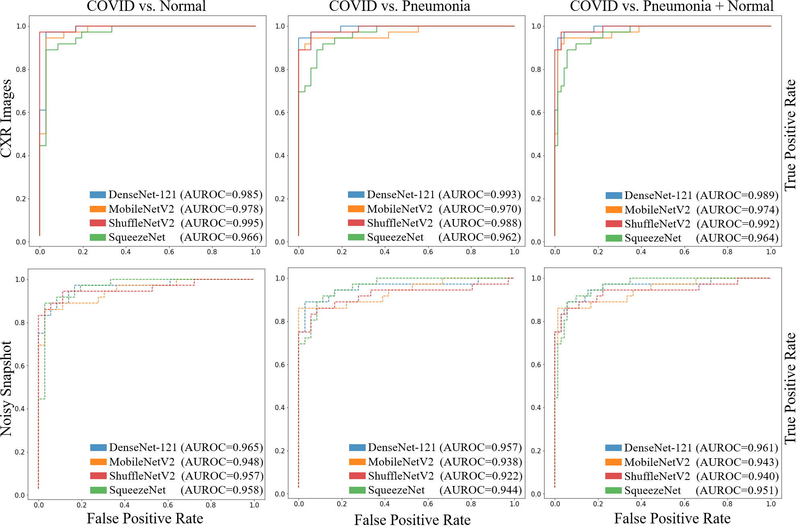

Overview
----
This repository is an implementation of the paper "[COVID-MobileXpert: On-Device COVID-19
Screening using Snapshots of Chest X-Ray](https://arxiv.org/abs/2004.03042)".

CXR Imaging Datasets
-----
* Pre-training Data (108,948 CXR Images)
  * [ChestX-ray8: Hospital-scale Chest X-ray Database and Benchmarks on Weakly-Supervised Classification and Localization of Common Thorax Diseases.](https://nihcc.app.box.com/v/ChestXray-NIHCC)  
* Fine-tuning Data (537 CXR Images)
  * [COVID-19 Image Data Collection.](https://github.com/ieee8023/covid-chestxray-dataset)  
  * [RSNA Pneumonia Detection Challenge.](https://www.kaggle.com/c/rsna-pneumonia-detection-challenge)  
* Fine-tuning data is split into training/validation/testing sets with 125/18/36 images for each class.

Snapshots Dataset
------
To create a noisy snapshot dataset, we first display the original CXR image on a PC screen and then use Microsoft Office Lens to scan and save the snapshot. Noisy snapshots will be converted to 8-bit gray-scale images. Each clean
CXR image from CXR image dataset has a noisy snapshot counterpart, Here is one example:
<p></p>


COVID-MobileXpert Architecture with Three-player KTD Training
----
<p></p>


Model Training and Evaluation
----
Codes and learned model parameters are available in the Main folder. Here are the steps for training and testing:
* Put the CXR images in the Dataset folder as the following structure:


```
Dataset
   train
      clean
      covid
      pneumonia
   test
      clean
      covid
      pneumonia
   validation
      clean
      covid
      pneumonia
```
* Download the pre-trained model [here](https://drive.google.com/file/d/1lgaGtAfdnjnziHSZ0TaYKisYGjwLxebU/view?usp=sharing) and save it into Teacher_model folder.
* Run the .ipynb file for training and testing.  

On-device Deployment of the COVID-MobileXpert
------
<p></p>

We provide the source code for deployment with [Pytorch Mobile](https://drive.google.com/file/d/1lgaGtAfdnjnziHSZ0TaYKisYGjwLxebU/view?usp=sharing) and [Android Studio](https://developer.android.com/studio), which is developed based on this [repository](https://github.com/johnolafenwa/PytorchMobile). The source code contains an example model, if you want to deploy other models, here are the steps:
* Download the pre-trained models.
* Use the script "TorchScript_converter.py" to convert the model to TorchScript (.pt).
* Put the model under "src/main/assets" folder
* Change the path in 'MainActivity.java' to the current .pt file.
* Build and test.

Results
----
Evaluation of COVID-19 Screening Performance using both CXR Images and Noisy Snapshots.
<p></p>

Demo
------


Dependencies
-----
* Python 3.7
* Pytorch 1.3

Citation
------
```
Xin Li, Chengyin Li and Dongxiao Zhu
COVID-MobileXpert: On-Device COVID-19 Screening using Snapshots of Chest X-Ray, arXiv:2004.03042, 2020  
https://github.com/xinli0928/COVID-Xray
```

```
@misc{li2020covidmobilexpert,
    title={COVID-MobileXpert: On-Device COVID-19 Screening using Snapshots of Chest X-Ray},
    author={Xin Li and Chengyin Li and Dongxiao Zhu},
    year={2020},
    eprint={2004.03042},
    archivePrefix={arXiv},
    primaryClass={eess.IV}
}
```
